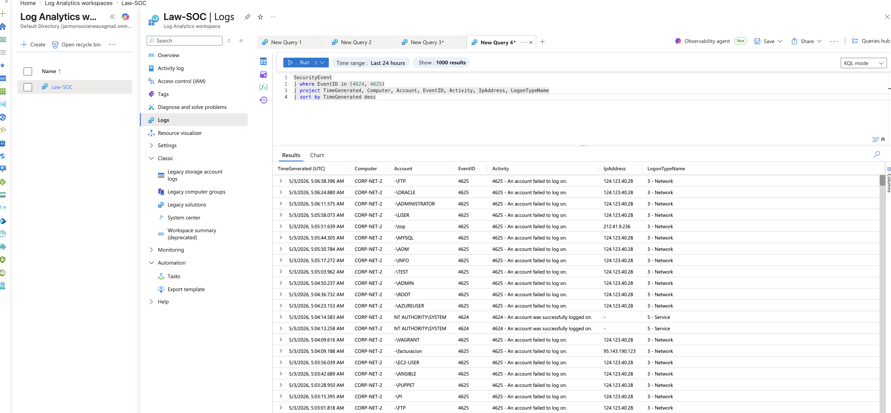
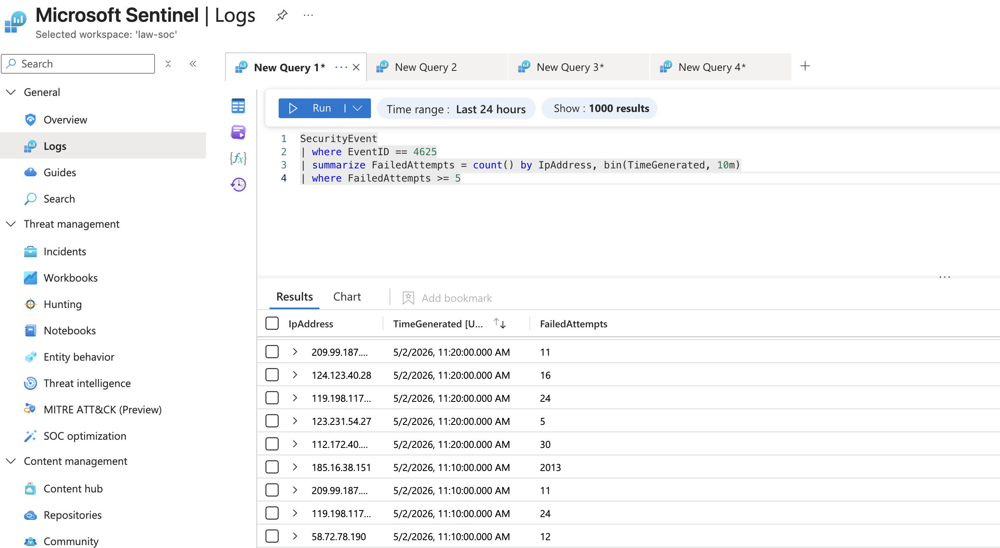
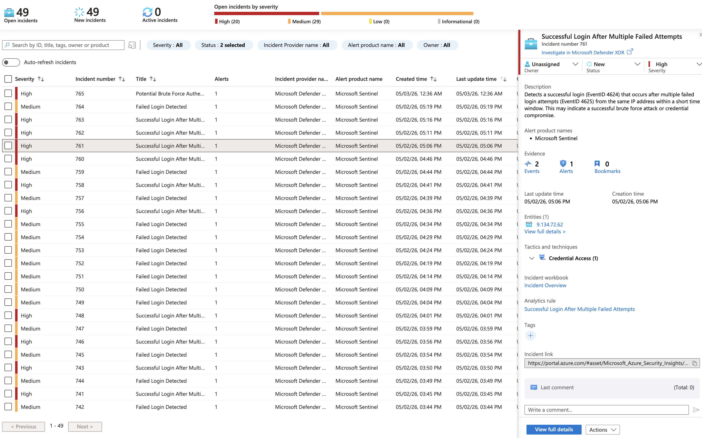

# Microsoft Sentinel Threat Detection Lab

In this project, I built a SIEM lab using Microsoft Sentinel in Azure to monitor and analyze authentication activity from a Windows virtual machine. The VM was intentionally exposed to the internet as a honeypot to attract and capture real-world login attempts. The goal of this lab was to simulate attacker behavior, detect brute-force activity, and understand how security events are investigated in a SOC environment.

---

## 📸 Screenshots & Walkthrough

### 1. Authentication Logs Ingested

This screenshot shows Windows Security Event logs being successfully ingested into Microsoft Sentinel from the virtual machine. I verified that both successful logins (Event ID 4624) and failed login attempts (Event ID 4625) were present in the data. This confirmed that log ingestion was working correctly and that authentication activity could be monitored within the environment.

---
### 2. Failed Login Attempts (Event ID 4625)

In this step, I filtered specifically for failed login attempts (Event ID 4625) to identify patterns of repeated authentication failures. The results showed multiple attempts coming from the same IP addresses within short time windows, which is not typical for normal user behavior. This pattern is commonly associated with brute force attacks, where an attacker repeatedly tries different credentials to gain access. By narrowing the data in this way, I was able to quickly identify suspicious IP addresses that required further investigation.

---

### 3. Successful Bruteforce Login Events (Event ID 4624)

Here, I expanded the analysis by including successful login events (Event ID 4624) alongside failed attempts. This allowed me to identify a key pattern where a single IP address generated multiple failed login attempts and then eventually succeeded. This sequence is a strong indicator of a successful brute force attack, where the attacker is able to guess the correct credentials after repeated attempts. Correlating failed and successful logins provides stronger evidence of compromise than failed attempts alone.

---

### 4. Detection Query

I created a KQL-based detection rule in Microsoft Sentinel to identify IP addresses with multiple failed login attempts followed by at least one successful login within a defined time window. This rule automates detection of potential brute-force attacks and generates alerts for further investigation.

---

 ### 5. Security Incident Generated in Microsoft Sentinel

This screenshot shows the security incident generated by the detection rule. The incident includes associated entities such as the source IP address, geolocation data, and related login events. This provides the necessary context for investigating a potential brute-force attack within a SOC environment.

---

### 6. Investigation Timeline

The investigation timeline provides a chronological view of alerts and related activity associated with the incident. This allows analysts to understand the sequence of events, validate the attack pattern, and trace the behavior of the source IP across multiple authentication attempts.

---

### 7. VM Activity Map

This map provides a visual representation of login attempts against the virtual machine from different geographic locations. Since the VM was intentionally exposed to the internet as a honeypot, it attracted traffic from various regions. The clustering of activity highlights how frequently internet-facing systems are targeted by automated scanning and attack attempts. This visualization helped reinforce the idea that these attacks are not random. They are constant and global, which is why continuous monitoring and automated detection are critical in real-world environments.

---

